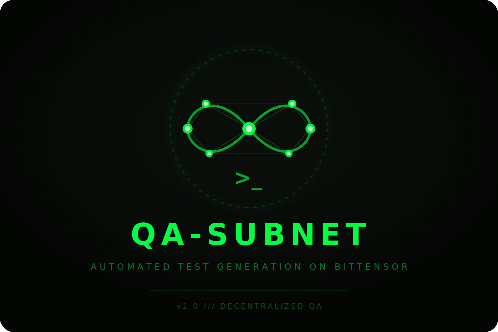

<p align="center">
  
</p>

# QA-Subnet: Automated Unit Test Generation on Bittensor

QA-Subnet is a Bittensor subnet dedicated to advancing the state of AI-generated software testing. Miners compete by fine-tuning large language models that write high-quality Python unit tests, while validators evaluate those tests through mutation testing inside secure sandboxes. The result is a decentralized marketplace where models are continuously refined to produce tests that truly verify code correctness, not just pass superficially.

The subnet operates on **netuid 389** (testnet). Validators call each miner's model directly through Chutes.ai, removing the need for trust in miner-side inference.

---

## Table of Contents

- [Why QA-Subnet Matters](#why-qa-subnet-matters)
- [How It Works](#how-it-works)
- [Challenge Generation](#challenge-generation)
  - [Template tiers](#template-tiers)
  - [Example challenge (simplified)](#example-challenge-simplified)
- [Reward System](#reward-system)
  - [Scoring](#scoring)
  - [EMA Smoothing](#ema-smoothing)
  - [Improvement Barrier and Top-3 Distribution](#improvement-barrier-and-top-3-distribution)
  - [Offline Decay](#offline-decay)
- [Getting Started](#getting-started)
- [Integrity and Security](#integrity-and-security)
- [Roadmap](#roadmap)
- [License](#license)

---

## Why QA-Subnet Matters

Software testing is one of the most time-consuming phases of the development cycle. Developers often write tests that cover the obvious cases but miss subtle edge conditions, off-by-one errors, and unhandled branches. Existing AI code assistants generate tests, but there is no systematic way to measure whether those tests actually catch real bugs.

QA-Subnet solves this by using **mutation testing** as the ground truth for test quality. Instead of asking "do these tests pass?", the subnet asks "if we introduce bugs into the code, do these tests catch it?". This creates a quantifiable, objective metric for test effectiveness that drives continuous improvement.

For the Bittensor ecosystem, QA-Subnet contributes a specialized intelligence that complements code generation subnets. While other subnets focus on writing code, QA-Subnet focuses on verifying it. The fine-tuned models that emerge from this competitive process can be used by any developer or organization to automatically generate high-coverage test suites, reducing bugs in production and accelerating software delivery.

For AI research more broadly, the subnet produces a growing dataset of (code, test, mutation-score) triples that captures what makes a test effective at catching real defects. This dataset, built from perfect-score evaluations, can fuel the next generation of code-aware AI models.

---

## How It Works

QA-Subnet has two roles: **miners** and **validators**.

**Miners** are developers or teams who fine-tune a language model to be excellent at writing Python unit tests. Once the model is ready, the miner uploads it to HuggingFace, deploys it on Chutes.ai so it can serve inference requests, and registers it on the Bittensor blockchain. After registration, the miner's job is done — the process stays running to maintain network presence, but the miner itself does not perform any inference. This is intentional: by having the validator control all inference calls, the network guarantees that the tests were genuinely produced by the registered model.

**Validators** orchestrate the entire evaluation cycle. In each round, the validator generates a Python code challenge (drawn from a library of 80+ synthetic templates covering algorithms, data structures, caches, graphs, codecs, and more — see [Challenge Generation](#challenge-generation)). It then selects a batch of miners and verifies that each miner's model is legitimate through a thorough 10-step verification process. For every verified miner, the validator calls that miner's model on Chutes.ai, asking it to produce unit tests for the challenge. The generated tests are first scanned for prohibited patterns (such as code introspection that could game the system), then executed inside a Docker sandbox with no network access, limited CPU, and limited memory. Inside the sandbox, **mutation testing** runs: the code under test is systematically modified (operators swapped, conditions negated, statements deleted) and the tests are re-executed against each mutation. If the tests catch the mutation (i.e., they fail when the bug is introduced), that mutant is considered "killed". The miner's score is the ratio of killed mutants to total mutants.

Scores are smoothed using an exponential moving average (EMA) across rounds, and rewards are distributed to the top-performing miners. After each round, the validator sends real-time feedback to every evaluated miner via a ScoreFeedback synapse, so miners can monitor their score, EMA, baseline, required threshold, and rank without external tools. The entire cycle — challenge generation, model verification, inference, sandbox execution, scoring, feedback, and weight setting — happens automatically every round without human intervention.

---

## Challenge Generation

Each round, the validator generates a fresh Python code challenge from a library of 80+ synthetic templates. The code is **not** pulled from open-source repositories — it is generated procedurally with randomized class names, method names, variable names, thresholds, and constants. This ensures that models cannot memorize answers; they must genuinely understand the code to write effective tests.

### Template tiers

| Tier | Examples | Difficulty |
|---|---|:-:|
| **Basic** (60 templates) | Classifiers, list processors, validators, string processors, stack/queue, linked list, LRU cache, heap, text index, graph traversal, state machine, expression evaluator, rule engine, codec pair, diff engine, serializer | Low–Medium |
| **Composition** (10 templates) | Circuit breaker with retry, observable collection, tiered cache (L1/L2), middleware pipeline, connection pool, undo/redo editor, priority router, schema migration engine, resource pool with leases, pub/sub with filters | Medium–High |
| **God-level** (10 templates) | Dijkstra pathfinder, AVL tree, matrix algebra, physics simulation, polynomial operations, Huffman codec, topological scheduler, LRU/LFU dual cache, regex NFA matcher, expression evaluator with AST | High |

Every template uses randomized naming pools (40 function prefixes × 40 suffixes, 25 class prefixes × 25 suffixes) so the same template produces visually different code each round. God-level and composition templates are further expanded to ~3,000 lines by injecting additional methods that operate on class attributes (numeric computations, list operations, dictionary manipulations).

### Example challenge (simplified)

A typical basic-tier challenge might produce code like this:

```python
class CacheProcessor:
    """Least Recently Used cache."""

    def __init__(self, capacity=8):
        self.capacity = capacity
        self.store = {}
        self._order = []

    def fetch(self, key, default=None):
        """Get value and mark as recently used."""
        if key not in self.store:
            return default
        self._order.remove(key)
        self._order.append(key)
        return self.store[key]

    def put(self, key, value):
        """Insert or update, evict LRU if full."""
        if key in self.store:
            self._order.remove(key)
        elif len(self.store) >= self.capacity:
            oldest = self._order.pop(0)
            del self.store[oldest]
        self.store[key] = value
        self._order.append(key)

    def remove(self, key):
        if key not in self.store:
            return False
        del self.store[key]
        self._order.remove(key)
        return True

    def size(self):
        return len(self.store)

    def clear(self):
        count = len(self.store)
        self.store = {}
        self._order = []
        return count
```

The miner's model must produce pytest tests that **kill as many mutants as possible** — for example, asserting exact return values after `put`/`fetch` sequences, testing eviction when capacity is exceeded, verifying that `remove` returns `False` for missing keys, and checking that `clear` returns the correct count. A test like `assert cache.size() == 0` after `clear()` would kill the mutant where `clear` returns `count + 1` or where `count = len(self.store)` is changed to `count = len(self._order)`.

---

## Reward System

The reward system is designed to be fair, resistant to gaming, and to encourage genuine improvement over time.

### Scoring

Each evaluation produces two independent metrics:

**Mutation Score** (0.0 to 1.0) measures how many code mutations the generated tests detected. The source code is systematically modified (operators swapped, conditions negated, statements deleted) and the tests are re-run against each mutation. If the tests catch the mutation (i.e., they fail when the bug is introduced), that mutant is "killed". The score is `killed_mutants / total_mutants`.

**Quality Ratio** (0.0 to 1.0) measures how many of the submitted tests actually pass on the unmodified code. If a model generates 9 tests but 1 has a bug and fails, quality is `8 / 9 = 0.8889`. This penalizes models that produce broken tests.

The final score is the product of both:

```
final_score = mutation_score * quality_ratio
```

For example:

| Scenario | Tests generated | Pass | Quality | Mutants killed | Score | Final |
|---|:-:|:-:|:-:|:-:|:-:|:-:|
| Good model | 10 | 10 | 1.00 | 73% | 0.73 | **0.73** |
| 1 broken test | 9 | 8 | 0.89 | 74% | 0.74 | **0.66** |
| Bad model | 10 | 5 | 0.50 | 80% | 0.80 | **0.40** |

The bad model kills more mutants (0.80) but half its tests fail, so its final score (0.40) is much worse. It is not enough to kill mutants — the tests must also be valid.

The mutation testing pipeline combines traditional mutations from mutmut (operator swaps, constant changes, boolean flips) with a custom AST-based engine that applies six harder mutation types: statement deletion, off-by-one modifications, full condition negation, return-value nullification, else/elif removal, and statement reordering. This combination ensures that only tests with deep coverage of branches, boundaries, side effects, and execution order achieve high scores.

### EMA Smoothing

Raw scores are not used directly for weight setting. Instead, each miner's score is blended into a running **exponential moving average** that starts from zero and uses a **warmup schedule**:

$$\text{EMA}_t = \alpha_t \cdot \text{score}_t + (1 - \alpha_t) \cdot \text{EMA}_{t-1}$$

$$\alpha_t = \begin{cases} 0.05 & \text{if evaluations} < 20 \quad \text{(warmup)} \\ 0.02 & \text{otherwise} \quad \text{(stable)} \end{cases}$$

New miners always start from $\text{EMA}_0 = 0$ — there is no seeding with the first score. This prevents a lucky first round from instantly displacing an established miner. Instead, the model must demonstrate **consistent performance** over multiple rounds to climb the rankings. The warmup alpha (0.05) allows faster initial convergence during the first 20 evaluations, then drops to the stable alpha (0.02) for long-term smoothing where each score contributes only 2%.

| Evaluations | Alpha | Convergence | Purpose |
|:-:|:-:|:-:|---|
| 1–20 | 0.05 | ~64% in 20 rounds | Fast ramp-up for new miners |
| 21+ | 0.02 | ~87% in 100 rounds | Stable long-term smoothing |

If a miner goes offline, its EMA decays by 5% per round ($\text{EMA}_t = 0.95 \cdot \text{EMA}_{t-1}$). After 5 consecutive offline rounds, the EMA and evaluation count are reset to zero so the miner starts fresh (including warmup) when it returns. Miners that time out three consecutive times receive a -0.1 EMA penalty.

### Improvement Barrier and Top-3 Distribution

The reward system uses two thresholds. **UID 0** runs the default model and sets the **floor** — the minimum score any miner must beat to be considered. The **baseline** tracks the **3rd-ranked miner's EMA** (the entry point to the top 3) and determines the improvement barrier. A new model must beat the current #3, not the #1 — otherwise strong top miners would block all new entries even when the newcomer is better than #3.

$$F_0 = \text{UID 0's EMA (floor)}$$

$$B = \text{3rd-ranked miner's EMA (baseline, or } F_0 \text{ if < 3 miners)}$$

$$p = 4.75 \times \left(1 + \cos(\pi B)\right) + 0.5$$

$$S_{req} = B \times \left(1 + \frac{p}{100}\right)$$

Where $F_0$ is the floor (UID 0), $B$ is the baseline (3rd-ranked miner above the floor, or $F_0$ if fewer than 3 exist), $p$ is the required improvement percentage (cosine decay from 10% to 0.5%), and $S_{req}$ is the minimum score for new models to earn rewards. The cosine curve is strict at low baselines (up to 10%) where there is plenty of room for improvement, and permissive at high baselines (down to 0.5%) where real gains are harder to achieve. New models (detected by a change in model hash) must exceed $S_{req}$; existing models with the same hash are exempt from the barrier but must still beat the floor $F_0$.

```
Score
     │                                           M1 ────────── 0.70 (top 1)
0.70 ┤                                         ╱
     │                                    ╭───╯   M4 ────────  new miner (0.62)
0.65 ┤                              ╭────╯      ╱
     │                        ╭─────╯     ╭────╯  M2 ──────── 0.60 (top 2)
0.60 ┤                  ╭─────╯     ╭────╯
     │            ╭─────╯     ╭────╯
0.55 ┤      ╭─────╯     ─────╯─────────────────── Baseline (top 3 = M3)
     │╭────╯       ·····························  Required Score
0.50 ┤╯≈≈≈≈≈≈≈≈≈≈≈≈≈≈≈≈≈≈≈≈≈≈≈≈≈≈≈≈≈≈≈≈≈≈≈≈≈≈≈ UID 0 floor
     │         M4 must beat M3 + improvement%
0.00 ┤──────────────────────────────────────────────
     └──┬──────┬──────┬──────┬──────┬──────┬──────┬──────┬─→
        0     25     50     75    100    125    150    175  200
                                  Rounds
```

**Reading the chart**: UID 0 stays around 0.50 (`≈≈≈` floor). The baseline (`───`) tracks the 3rd-ranked miner (M3 at ~0.55), not the top miner (M1 at 0.70). The required score (dots) sits just above the baseline. When M4 enters with a new model, it only needs to beat M3's score + improvement% — not M1's. Since 0.62 > required (~0.577), M4 passes the barrier and displaces M3 from the top 3. All EMAs fluctuate naturally over time as challenges vary in difficulty; rankings are dynamic even without model changes.

| Baseline | Improvement % | Required Score | Gap |
|:-:|:-:|:-:|:-:|
| 0.10 | 9.77% | 0.1098 | +0.010 |
| 0.30 | 8.04% | 0.3241 | +0.024 |
| 0.50 | 5.25% | 0.5263 | +0.026 |
| 0.70 | 2.46% | 0.7172 | +0.017 |
| 0.90 | 0.73% | 0.9066 | +0.007 |

Only the **top 3 miners** that clear both the floor and the barrier receive rewards, split as 60% for first place, 30% for second, and 10% for third. Any unclaimed reward slots are absorbed by UID 0. For example, if only one miner surpasses the floor, that miner receives 60% and UID 0 receives the remaining 40%. If no miner surpasses the floor, UID 0 receives 100%. Rankings are fully dynamic — miners rise and fall based on their EMA performance each round, even without changing models. The baseline adjusts accordingly, making it easier or harder for new entrants depending on how the current #3 is performing.

### Offline Decay

Miners that stop serving are tracked round by round. Their EMA decays by 5% per round while offline. After 5 consecutive offline rounds, the EMA is fully reset to zero. After 10 consecutive rounds without presence, the miner is removed from the selection pool entirely. When a miner comes back online after an extended absence, it starts fresh with no historical score, competing on current performance alone. This keeps the network clean and rewards only active participants.

---

## Getting Started

For detailed installation, configuration, and step-by-step instructions, see the dedicated setup guides:

- **[Validator Setup Guide](docs/validator_setup.md)** — Hardware requirements, Docker setup, configuration, and running the validator.
- **[Miner Setup Guide](docs/miner_setup.md)** — Model fine-tuning, Chutes deployment, and running the miner.

---

## Integrity and Security

QA-Subnet employs multiple layers of protection to ensure fair competition and prevent gaming.

All inference is controlled by the validator, which calls each miner's model through Chutes.ai directly. Miners never handle their own inference requests, eliminating the possibility of substituting a different model or modifying outputs in transit. The 10-step model verification process confirms that each miner's on-chain registration, HuggingFace repository, and Chutes deployment are consistent and legitimate before any evaluation takes place. Each deployment is pinned to a specific HuggingFace revision (commit SHA), which the validator uses to verify and hash the model at the exact version that was deployed. This prevents miners from swapping model weights on HuggingFace after registration.

Generated test code is scanned for prohibited patterns before execution. Any tests that attempt to inspect the source code through introspection (examining bytecode, parsing the AST, using reflection) are automatically rejected with a zero score.

Mutation testing itself runs inside a hardened Docker sandbox with no network access, restricted CPU and memory, and strict time limits. This prevents any form of external communication or resource abuse during evaluation.

The reward system uses model hashing and duplicate detection to prevent Sybil attacks where the same model is registered under multiple identities. The dynamic improvement barrier ensures that new registrations must demonstrably outperform the baseline, and the top-3 distribution ensures rewards are concentrated on models that genuinely advance test quality rather than being spread thinly across marginal participants.

---

## Roadmap

### Phase 1 — Foundation

**Status: Live.**

The subnet operates with the core loop fully functional.

This phase establishes the fundamental primitive: **a quantifiable, objective metric for test effectiveness** that no other system — centralized or decentralized — currently provides at scale.

**Key deliverables already shipped:**
- Mutation testing pipeline (mutmut + custom AST engine with 6 advanced mutation types)
- 10-step model verification and anti-Sybil protections
- Validator-controlled inference via Chutes.ai
- Real-time ScoreFeedback synapse for miner monitoring
- Hardened sandbox execution with no network, limited CPU/memory

---

### Phase 2 — Real-World Code & Dataset as Commodity

Phase 2 transitions from synthetic-only challenges to **real-world code**, and formalizes the subnet's primary digital commodity: a curated, versioned dataset of test effectiveness data.

#### Real-world challenge integration

Synthetic templates remain as a warmup tier, but the challenge pool expands to include functions and classes extracted from real open-source repositories (permissive licenses only: MIT, Apache 2.0, BSD). Validators pull code from a curated registry of repositories, apply the same randomization layer (renamed identifiers, shuffled methods) to prevent memorization, and evaluate miners against code that exists in production. This dramatically increases difficulty and practical relevance — models must handle incomplete documentation, implicit contracts, complex state, and real-world edge cases that synthetic templates cannot fully capture.

#### Open dataset publication

Every evaluation round produces structured data: the source code, the generated tests, per-mutant kill/survive results, and the final mutation score. Phase 2 formalizes this into a **versioned, publicly available dataset** published on HuggingFace:

- **Format**: `(source_code, generated_tests, mutation_results, mutation_score, quality_ratio, language, challenge_tier, model_hash)`
- **Curation**: only rounds with scores above a configurable quality threshold are included, ensuring the dataset represents genuinely effective tests
- **Versioning**: monthly snapshots with full provenance (which model produced each entry, which validator evaluated it)

This dataset becomes a standalone digital commodity — a benchmark for test effectiveness that does not exist anywhere today. Researchers training code-aware models, companies building internal testing tools, and other Bittensor subnets can all consume it.

#### Expanded mutation engine

The mutation testing engine adds domain-specific mutation operators targeting patterns common in real-world code: exception handling mutations (swapping exception types, removing try/except blocks), concurrency mutations (removing locks, reordering async operations), and API contract mutations (changing return types, modifying function signatures). This increases the discriminative power of the scoring system and pushes miners toward models that understand deeper program semantics.

---

### Phase 3 — Multi-Language Expansion

Phase 3 extends the subnet beyond Python to cover the most commercially demanded languages in software testing.

#### Language priority

| Priority | Language | Rationale |
|:-:|---|---|
| 1 | TypeScript / JavaScript | Largest developer population, massive testing demand in web/fullstack |
| 2 | Rust | Growing ecosystem, strong type system creates interesting mutation challenges |
| 3 | Go | Cloud infrastructure language, high demand for reliable testing |
| 4 | Java / Kotlin | Enterprise dominance, extensive legacy codebases needing test coverage |

Each language requires its own sandbox configuration (runtime, package manager, test runner), mutation operator set, and challenge template library. The scoring formula and reward system remain language-agnostic — mutation score × quality ratio applies universally.

#### Cross-language challenges

Once multiple languages are supported, the subnet introduces cross-language rounds where miners are evaluated on different languages within the same epoch. This rewards models with genuine code understanding over language-specific overfitting, and the resulting dataset captures cross-language test effectiveness patterns.

---

### Phase 4 — Utility Layer & External Demand

Phase 4 creates the **demand side** of the subnet: external consumers who pay for the testing intelligence. This is the phase that transforms QA-Subnet from an internal competition into infrastructure with real economic demand.

#### Public testing API

An API endpoint where any developer or organization can submit code and receive high-quality tests generated by the top-performing model on the subnet. The API uses a credit system. Requests are routed to the current top-ranked miner's model, ensuring consumers always get the best available intelligence.

#### CI/CD integration

A GitHub Action (and GitLab CI equivalent) that integrates directly into pull request workflows:

- On every PR, the action sends changed functions/classes to the QA-Subnet API
- Tests are generated by the top subnet model and mutation testing is run
- Results are posted as a PR check: mutation score, uncovered branches, suggested tests
- Teams can set minimum mutation score thresholds as merge gates

This positions QA-Subnet as a **standard part of the software delivery pipeline**, not an optional tool.

#### IDE plugin

A VS Code extension (with IntelliJ planned) that allows developers to select any function or class and generate mutation-tested unit tests on demand. The plugin calls the subnet API, runs the returned tests locally, and displays mutation coverage inline. This captures the individual developer market alongside the CI/CD enterprise market.

#### Cross-subnet synergy

Code generation subnets on Bittensor produce code — QA-Subnet verifies it. Phase 4 establishes formal integration points:

- Other subnets can submit generated code to QA-Subnet for automated quality scoring
- The mutation score becomes a **quality signal** that code generation subnets can use in their own reward mechanisms
- QA-Subnet becomes the verification oracle for code quality across the Bittensor ecosystem

---

### Phase 5 — Advanced Testing Paradigms

Phase 5 expands beyond unit test generation into more sophisticated testing methodologies, each of which opens new markets and produces new categories of training data.

#### Property-based testing

Instead of generating concrete test cases, models generate **properties** — invariants that must hold for any input. This is fundamentally harder than unit testing because the model must reason about the general behavior of code, not specific examples. Properties are evaluated using frameworks like Hypothesis (Python) and fast-check (TypeScript), with mutation testing still serving as the ground truth for property quality.

#### Intelligent fuzzing

AI-guided generation of inputs that maximize branch coverage and expose crashes, hangs, and undefined behavior. The model analyzes code structure and produces targeted inputs rather than random ones. Scoring is based on unique code paths discovered and unique failure modes triggered, measured against a baseline random fuzzer.

#### Security-oriented testing

Specialized challenges targeting common vulnerability patterns: injection flaws, authentication bypasses, race conditions, resource leaks, and insecure defaults. Models generate tests specifically designed to expose security issues. This category produces a security-focused dataset that has direct commercial value for auditing and compliance.

---

## License

MIT License.
